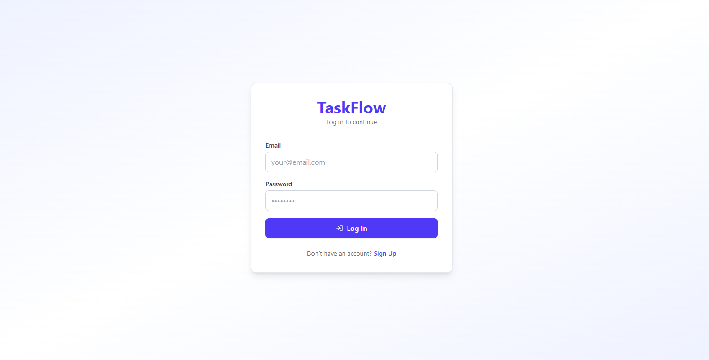
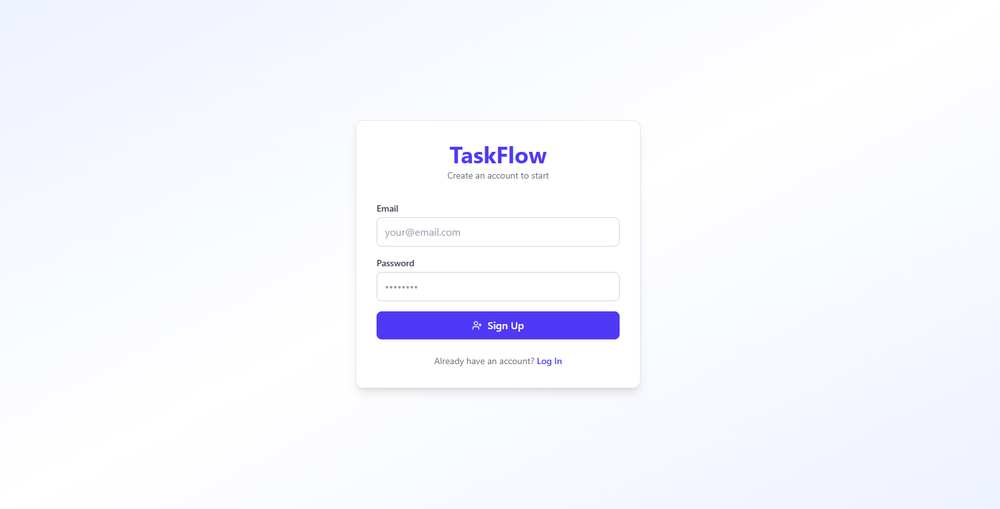
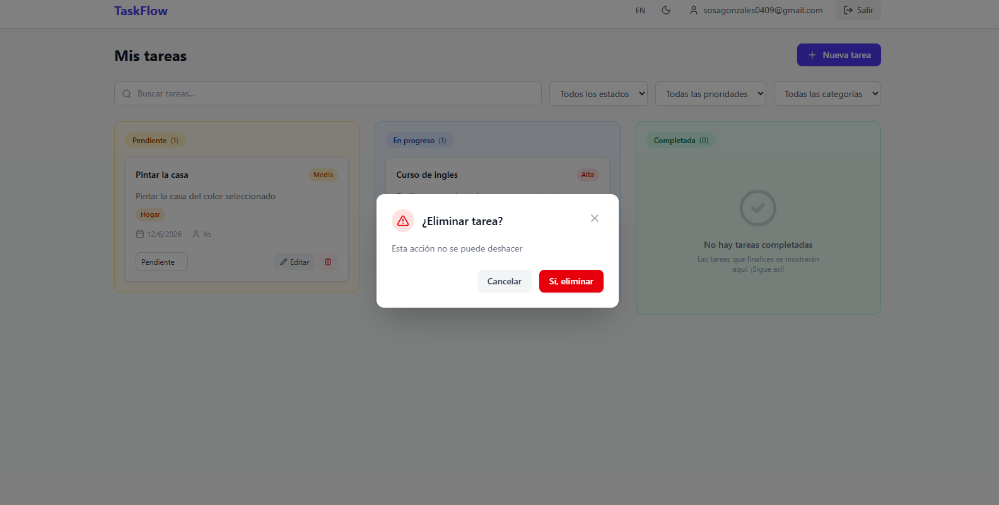
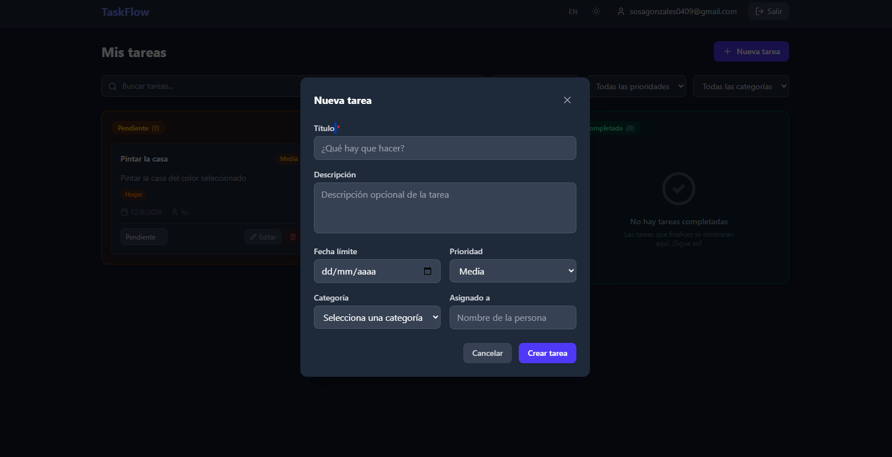
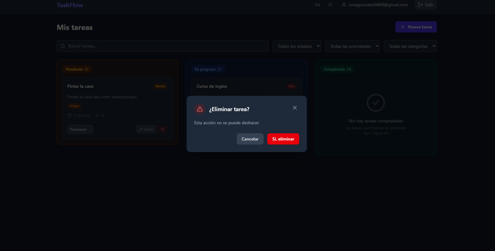

# ✅ TaskFlow

**React** · **TypeScript** · **Vite** · **Firebase Auth** · **Cloud Firestore** · **Tailwind CSS**

---

## Screenshots / Capturas

| Login | Register | Dashboard (EN) |
|-------|----------|-----------------|
|  |  |  |

| Dashboard Light / Claro | Add Task / Añadir Tarea | Delete Task / Eliminar Tarea |
|-------------------------|-------------------------|------------------------------|
|  |  |  |

| Dashboard Dark / Oscuro | Add Task / Añadir Tarea | Delete Task / Eliminar Tarea |
|--------------------------|-------------------------|------------------------------|
|  |  |  |

---

## Features

- Email/password authentication with Firebase Auth
- Real-time task sync with Cloud Firestore (subcollection per user)
- Kanban-style columns: Pending, In Progress, Completed
- Full CRUD: create, edit, and delete tasks
- Filters by status, priority, category, and text search
- Color-coded categories (Work, Personal, Study, Health, Finance, Home, Social, Other)
- Task fields: title, description, due date, priority, category, assigned person
- Multi-language support (EN/ES) via i18next
- Dark/light mode toggle
- Profile management (name, photo, display on Navbar)
- Responsive design (mobile-friendly)
- Toast notifications via sonner

## Características

- Autenticación con email/contraseña mediante Firebase Auth
- Sincronización de tareas en tiempo real con Cloud Firestore (subcolección por usuario)
- Columnas estilo Kanban: Pendiente, En progreso, Completada
- CRUD completo: crear, editar y eliminar tareas
- Filtros por estado, prioridad, categoría y búsqueda por texto
- Categorías por colores (Trabajo, Personal, Estudio, Salud, Finanzas, Hogar, Social, Otros)
- Campos de tarea: título, descripción, fecha límite, prioridad, categoría, persona asignada
- Soporte multi-idioma (EN/ES) mediante i18next
- Modo oscuro/claro
- Gestión de perfil (nombre, foto, mostrar en barra de navegación)
- Diseño responsive
- Notificaciones toast con sonner

---

## Tech Stack / Stack Tecnológico

| Technology / Tecnología | Usage / Uso |
|---|---|
| [React](https://react.dev) 19 | UI library |
| [TypeScript](https://www.typescriptlang.org) 5.9 | Type safety |
| [Vite](https://vitejs.dev) 7 | Build tool & dev server |
| [Firebase Auth](https://firebase.google.com/docs/auth) | Email/password authentication |
| [Cloud Firestore](https://firebase.google.com/docs/firestore) | Real-time NoSQL database |
| [Tailwind CSS](https://tailwindcss.com) 4 | Utility-first CSS framework |
| [React Router DOM](https://reactrouter.com) 7 | Client-side routing |
| [i18next](https://www.i18next.com) + react-i18next | Internationalization (EN/ES) |
| [lucide-react](https://lucide.dev) | Icons |
| [sonner](https://sonner.emilkowal.ski) | Toast notifications |
| [Vitest](https://vitest.dev) + Testing Library | Unit & component tests |

---

## Architecture / Arquitectura

```
App.tsx
  └─ BrowserRouter
      └─ AuthProvider                    ← Firebase Auth state (onAuthStateChanged)
          ├─ (no user) /login            ← LoginScreen / RegisterScreen
          └─ (user)
              ├─ /                       ← ProtectedRoute → Dashboard
              │   ├─ Navbar              ← User info, dark mode, language, logout
              │   ├─ Filters             ← Search, status, priority, category
              │   ├─ TaskCard × N        ← Columnas: Pending / In Progress / Completed
              │   │   └─ ConfirmDialog   ← Delete confirmation
              │   └─ TaskForm            ← Create / Edit modal (drawer)
              ├─ /profile                ← ProtectedRoute → Profile editor
              └─ *                       ← Redirect to /404
```

### Data flow / Flujo de datos

**English**: Tasks are stored in a per-user subcollection `users/{uid}/tasks/` in Firestore. The `useTasks` hook subscribes to real-time updates via `onSnapshot` with `where("userId", "==", uid)`, sorts them client-side by creation date, and groups them by status. The `AuthProvider` manages authentication state via `onAuthStateChanged` and exposes `user`, `loading`, `login`, `register`, `logout`, and `updateUserProfile`.

**Español**: Las tareas se almacenan en una subcolección por usuario `users/{uid}/tasks/` en Firestore. El hook `useTasks` se suscribe a actualizaciones en tiempo real mediante `onSnapshot` con `where("userId", "==", uid)`, ordena por fecha de creación del lado del cliente y las agrupa por estado. El `AuthProvider` gestiona el estado de autenticación mediante `onAuthStateChanged` y expone `user`, `loading`, `login`, `register`, `logout` y `updateUserProfile`.

---

## Project Structure / Estructura del Proyecto

```
src/
├── components/
│   ├── ConfirmDialog.tsx          # Delete confirmation modal
│   ├── EmptyState.tsx             # Empty column placeholder
│   ├── Filters.tsx                # Search, status, priority, category filters
│   ├── Navbar.tsx                 # Top bar: profile, theme, language, logout
│   ├── ProtectedRoute.tsx         # Auth gate component
│   ├── Skeleton.tsx               # Loading skeleton placeholder
│   ├── TaskCard.tsx               # Individual task card
│   ├── TaskForm.tsx               # Create / Edit task drawer
│   ├── ConfirmDialog.test.tsx
│   ├── EmptyState.test.tsx
│   ├── ProtectedRoute.test.tsx
│   ├── Skeleton.test.tsx
│   └── TaskCard.test.tsx
├── context/
│   └── AuthContext.tsx            # Firebase Auth provider
├── hooks/
│   ├── useAuth.ts                 # Auth context hook
│   ├── useTasks.ts                # Firestore CRUD + real-time hook
│   ├── useDarkMode.ts             # Dark mode toggle hook
│   └── useDarkMode.test.ts
├── i18n/
│   ├── index.ts                   # i18next configuration
│   └── locales/
│       ├── en.json                # English translations
│       └── es.json                # Spanish translations
├── firebase/
│   └── config.ts                  # Firebase init + auth/db exports
├── types/
│   └── task.ts                    # TypeScript types & constants
├── test/
│   └── setup.ts                   # Vitest + Testing Library setup
├── App.tsx                        # Root component (router + providers)
├── main.tsx                       # Entry point
└── index.css                      # Tailwind CSS entry + global styles
```

---

## Getting Started / Comenzando

### Prerequisites / Prerrequisitos

**English**:
- Node.js >= 18
- Firebase project ([console](https://console.firebase.google.com))

**Español**:
- Node.js >= 18
- Proyecto de Firebase ([consola](https://console.firebase.google.com))

### Installation / Instalación

```sh
git clone https://github.com/your-user/taskflow.git
cd taskflow
npm install
```

### Firebase Configuration / Configuración de Firebase

**English**:

1. Go to [Firebase Console](https://console.firebase.google.com)
2. Create a new project (or use existing)
3. Enable **Authentication** → **Sign-in method** → **Email/Password**
4. Create a Firestore database (start in test mode)
5. Copy `.env.example` to `.env` and fill in your Firebase credentials:

```sh
cp .env.example .env
```

```
VITE_API_KEY=your_api_key
VITE_AUTH_DOMAIN=your_project.firebaseapp.com
VITE_PROJECT_ID=your_project_id
VITE_STORAGE_BUCKET=your_project.appspot.com
VITE_MESSAGING_SENDER_ID=your_sender_id
VITE_APP_ID=your_app_id
```

**Español**:

1. Ve a [Firebase Console](https://console.firebase.google.com)
2. Crea un nuevo proyecto (o usa uno existente)
3. Habilita **Authentication** → **Sign-in method** → **Email/Password**
4. Crea una base de datos Firestore (en modo prueba)
5. Copia `.env.example` a `.env` y completa tus credenciales de Firebase:

```sh
cp .env.example .env
```

```
VITE_API_KEY=tu_api_key
VITE_AUTH_DOMAIN=tu_proyecto.firebaseapp.com
VITE_PROJECT_ID=tu_project_id
VITE_STORAGE_BUCKET=tu_proyecto.appspot.com
VITE_MESSAGING_SENDER_ID=tu_sender_id
VITE_APP_ID=tu_app_id
```

### Run / Ejecutar

```sh
npm run dev
```

Open [http://localhost:5173](http://localhost:5173) in your browser.

---

## Firebase Security Rules / Reglas de Seguridad

**English**: The following rules ensure users can only read and write their own tasks stored under `users/{uid}/tasks/`.

**Español**: Las siguientes reglas aseguran que los usuarios solo puedan leer y escribir sus propias tareas almacenadas bajo `users/{uid}/tasks/`.

```
rules_version = '2';
service cloud.firestore {
  match /databases/{database}/documents {
    match /users/{userId}/{document=**} {
      allow read, write: if request.auth != null && request.auth.uid == userId;
    }
  }
}
```

**Note**: Tasks are stored in the subcollection `users/{uid}/tasks/`. The rule `request.auth.uid == userId` ensures each user can only access their own data. This applies to all nested documents under `users/{userId}/`.

**Nota**: Las tareas se almacenan en la subcolección `users/{uid}/tasks/`. La regla `request.auth.uid == userId` asegura que cada usuario solo pueda acceder a sus propios datos. Esto aplica a todos los documentos anidados bajo `users/{userId}/`.

---

## Scripts

| Script | Description |
|---|---|
| `npm run dev` | Start development server |
| `npm run build` | Type-check + production build |
| `npm run preview` | Preview production build locally |
| `npm run lint` | Run ESLint |
| `npm run test` | Run tests (Vitest) |
| `npm run test:watch` | Run tests in watch mode |

---

## Live Demo

[https://taskflow-lake-five.vercel.app](https://taskflow-lake-five.vercel.app)

---

## 👤 Author / Autor

**Luis Alberto Sosa González**  
[](https://www.linkedin.com/in/luis-sosa-reactnative)

---

## License / Licencia

MIT
